# Crafties

Crafties is a fictional online off-license which specialises in craft beer. It is a fully functional e-commerce store which utilises Django to construct and Postgres for the Database. It also uses Stripe for the payment system and Amazon web services for the file and media storage.

[View Live Website Here](https://crafties-ms4-jg.herokuapp.com/)

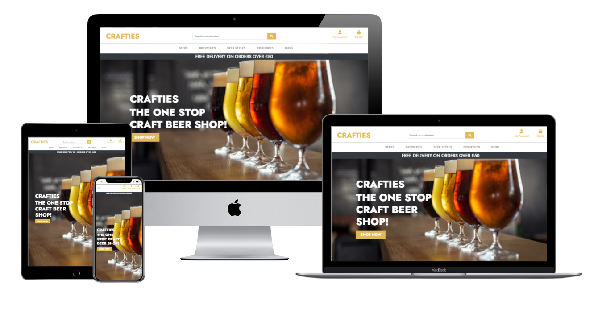

# UX
## User Stories
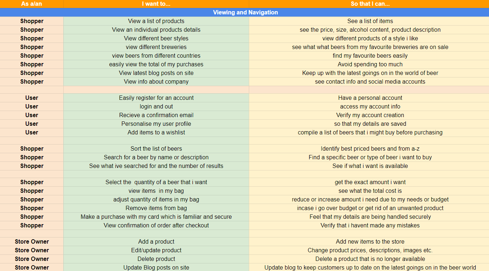

___

# Design Choices

### Colour Scheme

My aim with the colour scheme of the site was for the aesthetic to be visually pleasing. I used the gold colour which has quite a rich feel and a colour of beer to it, inkeeping with the theme of the site. I offset this with a bootstraps built in Dark class which is more of a charcoal colour which brought contrast without being to jarring visually.

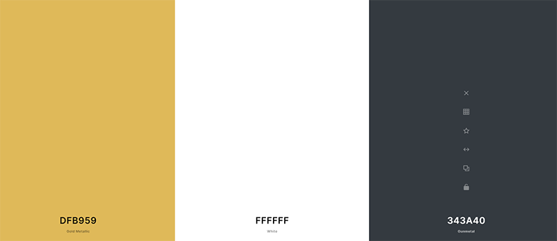

### Typography

The font I have used was chosen to both eye catching and funtional. I think the Jost font adds a stylish and energetic look to the app.

[Google Fonts](https://fonts.google.com/): Jost

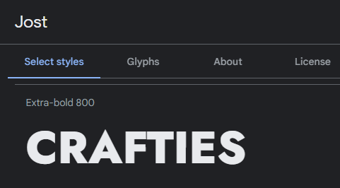

## Wireframes 

Here are my original wireframe mockups.

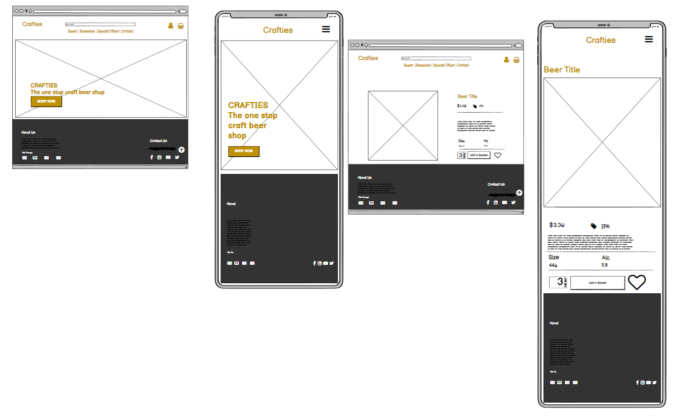

For the design of the app i wanted to keep things simple and easy to navigate. I used Balsamiq to create some mock ups of the visual nature of  the app.

* I used a big impactful heroimage for the landing page

* I added a footer with the about, contact and socials information so that this info would be readily available across all pages rather than building seperate pages for the info and bloating the app.

# Database Design

## Database Schema

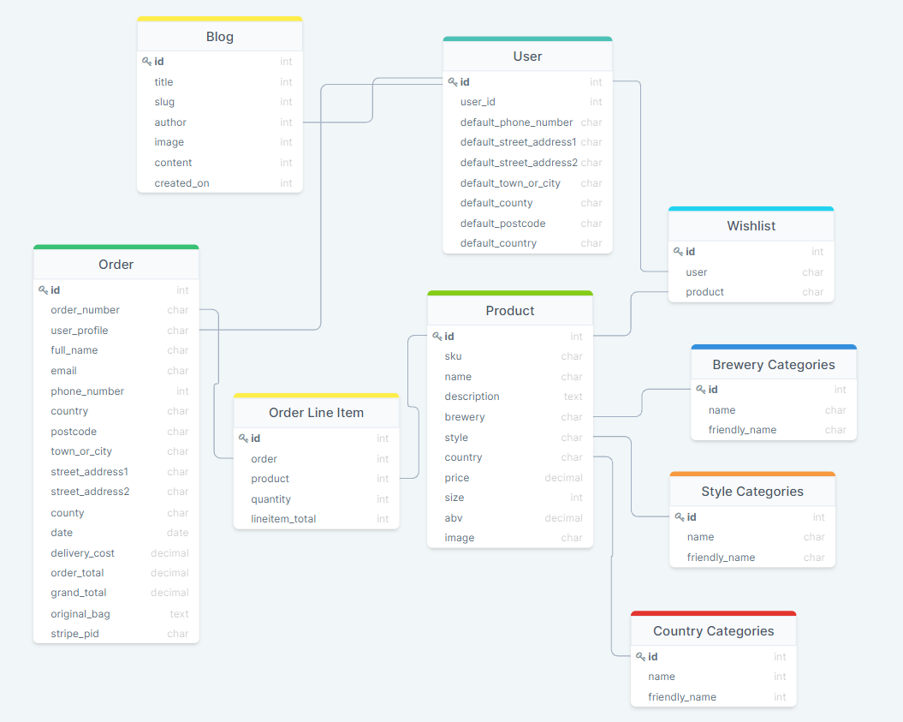

--------

# Features

* Home and Base templates

    Feature the home page and the base template which runs the header, navbars and footer across all pages on the app. This also includes the toasts for the app which provide updated shopping bag info.

    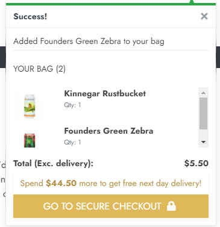

* Bag

    Contains all the code for the shopping bag.

* Profiles

    Contains a form for users info and order history.

    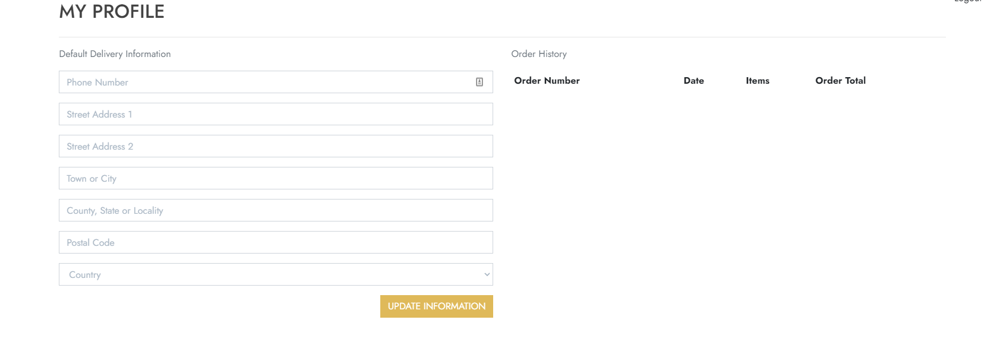

* Product

    Contains product view and also access to product manager for the site owner to add and edit products on the app.

    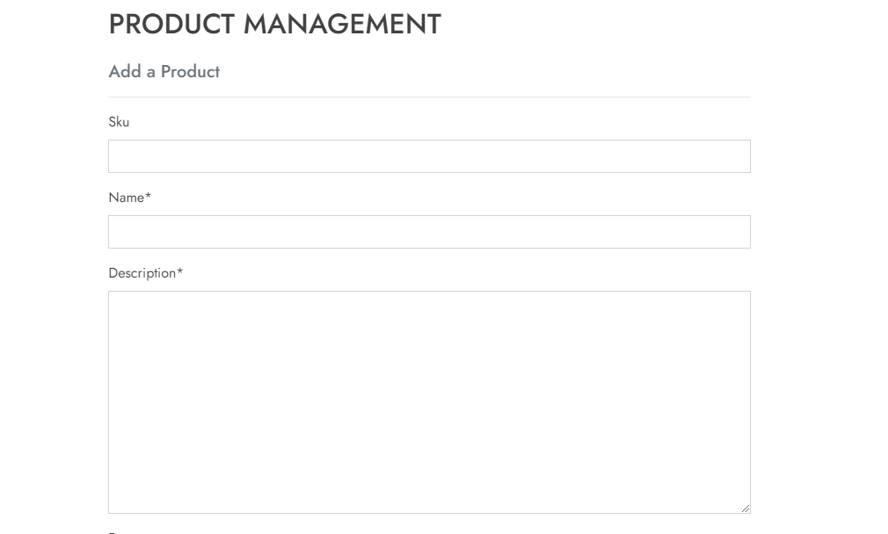

* Checkout

    Contains a form for the shoppers details and an order summary.

    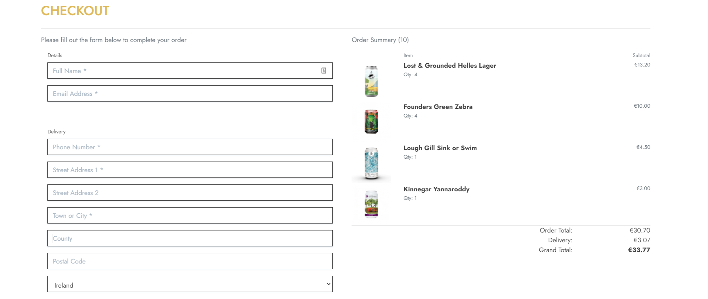

* Blog

    Contains the blog section of the app, where there will be regular blog posts added by the site owner. 

    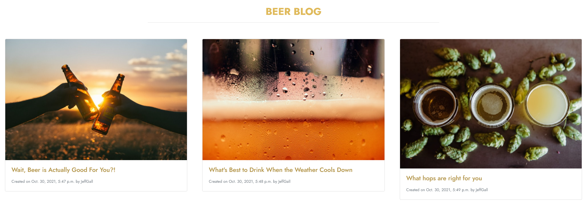

* Wishlist

    Contains all the functionality for the wishlist feature of the site, where to can use the heart toggle button on the product detail page to add or remove items from a wishlist.

    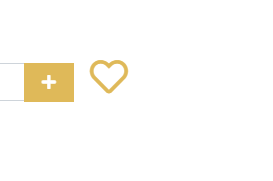

## Future Scope

* Ratings and Comments feature for each beer.

* A special offers, deals and beers of the month section.

* An expanded breweries section.
----------

# Technologies Used

## Languages Used

* [HTML](https://en.wikipedia.org/wiki/HTML5)
* [CSS](https://en.wikipedia.org/wiki/CSS)
* [Javascript](https://en.wikipedia.org/wiki/JavaScript)
* [Python](https://en.wikipedia.org/wiki/Python_(programming_language))
* [Django](https://www.djangoproject.com/)

# Frameworks, Libraries, Programs and Sites.

* [Django](https://materializecss.com/) - used as a framework in conjunction with Python

* [Bootstrap](https://getbootstrap.com/) - used for Navbar, grid system and styling throughout the site.

* [Photoshop](https://www.adobe.com/ie/products/photoshop.html) - for image editing.

* [Balsamiq](https://balsamiq.com/) - for wireframes.

* [tinypng](https://tinypng.com/) - to reduce the size of the images used.

* [FontAwesome](https://fontawesome.com/) - for the icons used on the site.

* [Google Fonts](https://fonts.google.com/) - for the fonts used. 

* [GitHub](https://github.com/) - to host and publish the site.

* [Gitpod](https://gitpod.io/) - Used for version control by utilizing the Gitpod terminal to commit to Git and Push to GitHub.

* [Jquery](https://jquery.com/) - for the JS.

* [SQLite](https://www.sqlite.org/) - for the initial database.

* [PostgreSQL](https://www.postgresql.org/) - for the Heroku deployed database.

* [Heroku](https://www.heroku.com/) - Used for deployment of web app.

* [Stripe](https://stripe.com/) - Used for payments system on the app.

* [Amazon Web Services](https://aws.amazon.com/) - Used s3 bucket for storing media and static files.

# Testing

## Manual Testing

Manual testing was carried out on devices of all sizes including desktop, tablet and mobiles.

## Code Validation

I used W3 Schools code validators for the HTML and CSS.

* I found a couple of bugs in the code which i have rectified, there was a duplicate ID tag and a href attribut in a span tag which have been removed.

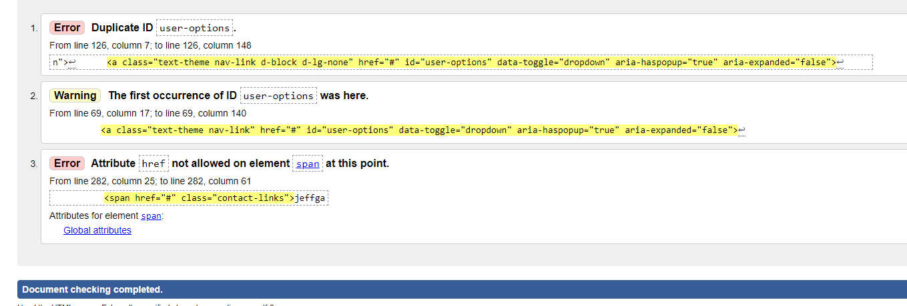

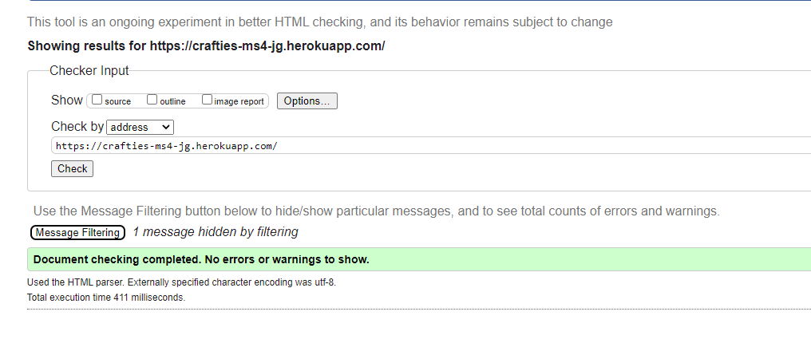

* There were no errors in the CSS.

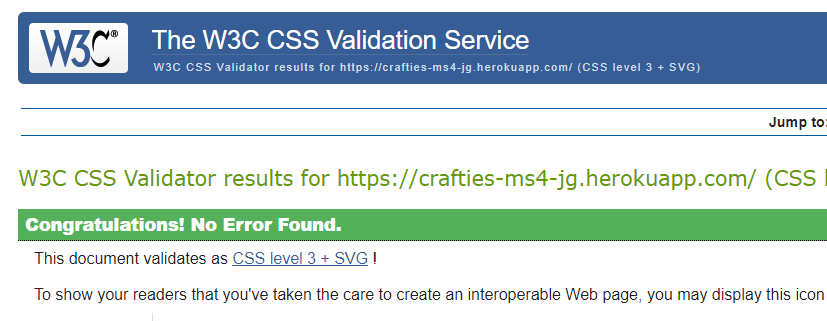

## Other Testing

* I ran the [JSHint](https://jshint.com/) command in the terminal to review the javascript code and corrected where possible.

* I ran the [Flake8](https://flake8.pycqa.org/en/latest/) command in the terminal to review the python code and corrected where possible to clean the code and make it Pep8 compliant.

---

## Lighthouse Accessibility Report

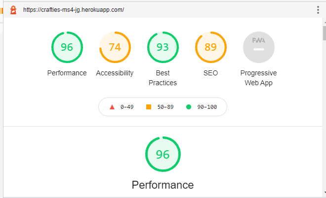

# Deployment

## Deploying Project

This project was deployed to [Heroku](https://www.heroku.com/) as follows:

1. Create a requirements.txt file by typing the following command into the terminal: pip3 freeze --local > requirements.txt

2. Create a Procfile by typing the following command into the terminal:
echo web: python run.py > Procfile

3. Save, add, commit and push the new files to your repository.

4. Sign Up/Login into [Heroku](https://www.heroku.com/) and create a new app. Give the app a unique name.

5. Select 'GitHub' from Deployment method options and search for the repository name. Once found, click on connect.

6. Head over to the settings menu and update the Config Vars to the following key, value pairs:

7. Go to the deploy tab and click on Deploy Branch.

## Cloning Project 

1. Log-in to GitHub and open the repo for [Crafties](https://github.com/jeffgallagher86/crafties-ms4)
2. Locate and click on the code section at the top of the page.
3. Click the code button as shown below to show copy of URL
4. Open Git bash terminal.
5. Change the current working directory to the location where you want the cloned directory.
6. Type in "git clone" followed by the copied URL and press enter key to create a local clone.

# Credits

## Code Institute - Boutique Ado

* A lot of the code and design for this project was adapted from Code Institute's Boutique Ado project

## Media

* Credit goes to [Craft Beers Delivered](https://www.craftbeersdelivered.com/) for the site content including images and beer descriptions and info.

* Credit goes to [Craft Beer Club](https://craftbeerclub.com/blog) for the blog content of the site.

* All other images on the site are from unsplash.

## Code

* Fonts used courtesy of [Google Fonts](https://fonts.google.com/).

* CSS used for Navbar, grid system and styling throughout the site taken from [Bootstrap](https://getbootstrap.com/).

* Icons used in site taken from [Font Awesome](https://fontawesome.com/).

* Some small snippets of code used from users on [Stack Overflow](https://stackoverflow.com/) and YouTube.

* Credit also goes to [w3Schools](http://w3schools.com/) for help along the way.

## Acknowledgements
* I would like to thank my mentor Rohit Sharma for all his help with this project.

* I'd also like to thank all at Code Institute and the CI slack community for all their help along the way.

**Thank you very much for taking the time to review my work!**

