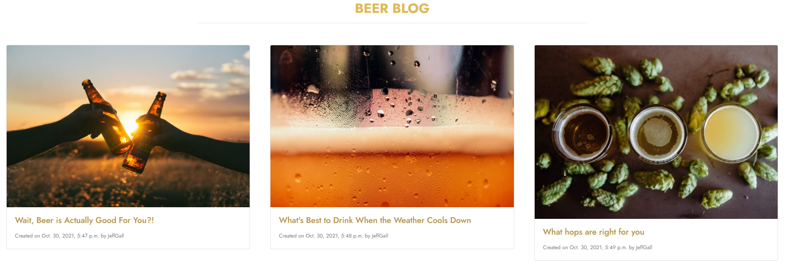
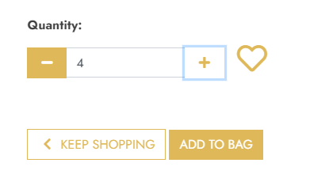
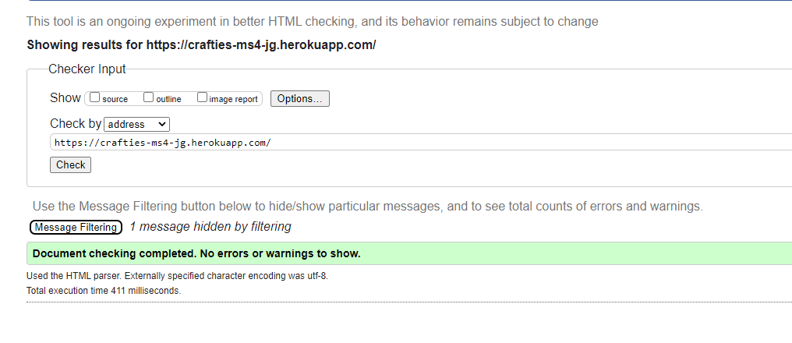

# Testing

## Manual Testing

### User Stories Testing

* As a shopper I want to view a list of products so that i can see what i can buy

* As a shopper i want to view an individual products details so that i can see the price, size, alcohol content, product description

* As a shopper i want to view different beer styles so that i can view different products of a style i like

* As a shopper i want to view different breweries so that i can see what what beers from my favourite breweries are on sale

* As a shopper i want to view beers from different countries so that i can find my favourite beers easily

* As a shopper i want to easily view the total of my purchases so that i can avoid spending too much and see how much more i need to spend for free delivery

* As a shopper i want to view latest blog posts on site so that i can Keep up with the latest goings on in the world of beer

* As a shopper i want to view info about company so that i can see contact info and social media accounts

* As a shopper i want to sort the list of beers so that i can identify best priced beers and from a-z

* As a shopper i want to search for a beer by name or description so that i can find a specific beer or type of beer i want to buy

* As a shopper i want to see what ive searched for and the number of results so that i can see if what i want is available

* As a shopper i want to select the quantity of a beer that i want so that i can get the exact amount i want

* As a shopper i want to adjust quantity of items in my bag so that i can reduce or increase amount i need due to my needs or budget

* As a shopper i want to Remove items from bag so that i can incase i go over budget or get rid of an unwanted product

* As a shopper i want to Make a purchase with my card which is familiar and secure so that i can Feel that my details are being handled securely

* As a shopper i want to view confirmation of order after checkout so that i can verify that i havent made any mistakes

* As a shopper i want to recieve email confirmation of my purchase

* As a user i want to easily register for an account so that i can have a personal account

* As a user i want to Recieve a confirmation email so that i can Verify my account creation

* As a user i want to login and out so that i can access my account info

* As a user i want to personalise my user profile so that i can so that my details are saved

* As a user i want to add items to a wishlist so that i can compile a list of beers that i might buy before purchasing

* As the store owner i want to add a product so that i can add new items to the store

* As the store owner i want to edit/update product so that i can change product prices, descriptions, images etc.

* As the store owner i want to delete product so that i can Delete a product that is no longer available

All tests carried out on Email confirmation, Updating Product, etc. Successful

### Responsivenes Testing

---

## Automated Testing

### Code Validation
---
I used W3 Schools code validators for the HTML and CSS.

* I found a couple of bugs in the code which i have rectified, there was a duplicate ID tag and a href attribut in a span tag which have been removed.

* There were no errors in the CSS.

## Other Testing
---
* I ran the [JSHint](https://jshint.com/) command in the terminal to review the javascript code and corrected where possible.

* I ran the [Flake8](https://flake8.pycqa.org/en/latest/) command in the terminal to review the python code and corrected where possible to clean the code and make it Pep8 compliant.

---

## Lighthouse Accessibility Report

- Added meta description tag in base template to improve seo rating of 89 to 100

`<meta name="description" content="crafties an irish online craft beer shop, selling ale, lager, stout, saison.">`