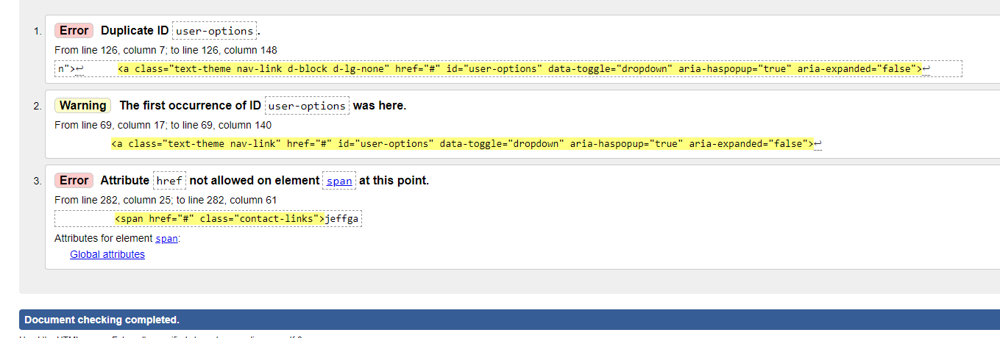
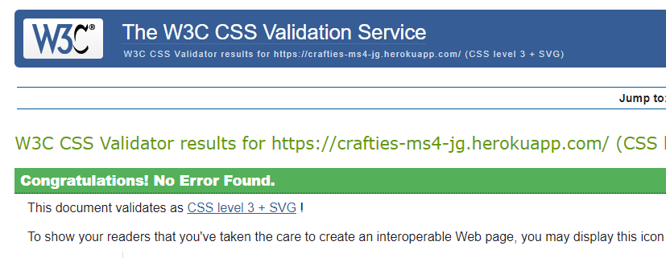

# Testing

## Manual Testing

### Links & Navs Functionality

| As a/an | I want to | I want to |
| ----------- | ----------- | ----------- |
| Header | Title |
| Paragraph | Text |

### User Stories Testing

| As a/an | I want to | So that i can... |
| ----------- | ----------- | ----------- |
| Shopper | View a list of products |	See a list of items |
| Shopper | View an individual products details	| See the price, size, alcohol content, product description |
| Shopper	View different beer styles	view different products of a style i like
| Shopper	view different breweries	see what what beers from my favourite breweries are on sale
| Shopper	view beers from different countries	find my favourite beers easily
| Shopper	easily view the total of my purchases	Avoid spending too much
| Shopper	View latest blog posts on site	Keep up with the latest goings on in the world of beer
| Shopper	View info about company	see contact info and social media accounts
		
| User	Easily register for an account	Have a personal account
| User	login and out	access my account info
| User	Recieve a confirmation email	Verify my account creation
| User	Personalise my user profile	so that my details are saved
| User	Add items to a wishlist	compile a list of beers that i might buy before purchasing
		
| Shopper	Sort the list of beers	Identify best priced beers and from a-z
| Shopper	Search for a beer by name or description	Find a specific beer or type of beer i want to buy
| Shopper	See what ive searched for and the number of results	See if what i want is available
		
| Shopper	Select the  quantity of a beer that i want	get the exact amount i want
| Shopper	view items  in my bag	see what the total cost is
| Shopper	adjust quantity of items in my bag	reduce or increase amount i need due to my needs or budget
|Shopper	Remove items from bag	incase i go over budget or get rid of an unwanted product
| Shopper	Make a purchase with my card which is familiar and secure	Feel that my details are being handled securely
| Shopper	View confirmation of order after checkout	Verify that i havent made any mistakes
		
| Store Owner	Add a product	Add new items to the store
| Store Owner	Edit/update product	Change product prices, descriptions, images etc.
| Store Owner	Delete product	Delete a product that is no longer available
| Store Owner	Update Blog posts on site	Update blog to keep customers up to date on the latest goings on in the beer world

### Responsivenes Testing

---

## Automated Testing

### Code Validation
---
I used W3 Schools code validators for the HTML and CSS.

* I found a couple of bugs in the code which i have rectified, there was a duplicate ID tag and a href attribut in a span tag which have been removed.

* There were no errors in the CSS.

## Other Testing
---
* I ran the [JSHint](https://jshint.com/) command in the terminal to review the javascript code and corrected where possible.

* I ran the [Flake8](https://flake8.pycqa.org/en/latest/) command in the terminal to review the python code and corrected where possible to clean the code and make it Pep8 compliant.

---

## Lighthouse Accessibility Report

- Added meta description tag in base template to improve seo rating of 89 to 100

`<meta name="description" content="crafties an irish online craft beer shop, selling ale, lager, stout, saison.">`